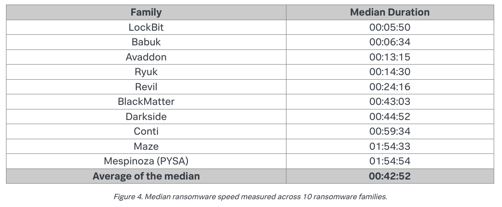

<p align="center">
<!-- Place this tag where you want the button to render. -->
<a class="github-button" href="https://github.com/0x00wolf/PATHBYTER-Hybrid-Encryption-Ransomware-with-Multiprocessing-in-Python" data-icon="octicon-star" aria-label="Star 0x00wolf/PATHBYTER-Hybrid-Encryption-Ransomware-with-Multiprocessing-in-Python on GitHub">Like this project? Give it a star! Click here</a>

# Pathbyter: Hybrid Encryption Ransomware with Multiprocessing in Python
***
Pathbyter is a lightning-fast and fully functioning proof-of-concept ransomware that emulates the advanced tactics employed in the development of malware like Conti, REvil, WannaCy, Lockbit, and Ryuk. 


## Table of Contents

1. [Why build Pathbyter?](#History)
2. [Disclaimer](#Disclaimer)
3. [Requirements](#Requirements)
4. [How fast is Pathbyter?](#how-fast-is-pathbyter?)
5. [Usage](#usage)
7. [How Pathbyter works](#how-pathbyter-works)


## History

I am a very curious person. While reading security research reports on different ransomware strains, I saw a pattern of programmatic features common among them that interested me. I researched Python ransomware projects on Github to see what solutions others had come up with to emulate those features. Almost every example I read encrypted files in an os.walk() loop and then displayed a ransom message asking for Bitcoin. Many lacked most if not all of the elements that I was really curious about. I had some ideas as to how I would go about implementing those features. Mix in some time and creative problem solving and we arrive at Pathbyter.


## Disclaimer

Pathbyter is intended for educational purposes or for approved red team exercises only. The author does not take any responsibility for the misuse of this software, nor does he approve of the redistribution of this software for anything other than legitimate educational and/or professional reasons. **Do not use Pathbyter on a box you have not been given express permission to run it on.** Do give me a star if you like the code!


## Requirements

Pathbyter uses one non-Standard Python Library module, pycryptodome ([readthedocs])(https://pycryptodome.readthedocs.io/en/latest/)), to gain access to the various cryptographic ciphers that it uses. 

To install pycryptodome use:
```pip install pycryptodome```


## How fast is Pathbyter?

Pathbyter, as it says in the intro blurb, is wicked fast. To generate test data that would allow me to compare Pathbyter's encryption performacnce to 'real' ransomware in the wild, I used research courtesy of Splunk. 

Splunk:
>We tested every sample across all four host profiles, which amounted to 400 different ransomware runs (10 families x 10 samples per family x 4 profiles). In order to measure the encryption speed, we gathered 98,561 test files (pdf, doc, xls, etc.) from a public file corpus, totaling 53GB.

The researchers at Splunk arrived at the following results:



To use this dataset as a meaningful comparison for Pathbyter I took the following steps: 
1) I wrote a Python script that generated 100,000 garbage files, each 512kb, full of "hello world" on repeat. The files being different 'types' is redundant if the size is the same. We are flipping bits and not interested in the content.
2) I streamlined Pathbyter's code (dropped internal function calls for the main attack loop).
3) I let 'er rip bud.


With multiprocessing you can speed up Python programs by a significant multiplier, paritcularly for CPU heavy tasks like encryption.   

Something I observed as common pracitce among the major ransomware variations was optimizing the encryption function by limiting the number of IO calls for each file to one read and write, which included storing the associated encrypted AES key needed to decode the file. They accomplished this by appending the AES key to the encrypted data before writing it back over the original file.

In Pathbyter's case, we invoke an instance of the multiprocessing Pool class, which takes one argument, the number of logical CPUs in the system it is invoked on. Then we use the Pool class's map() method, which takes a function and an iterable. The map method chunks the iterable up dividing it between the number of logical cores, and begins that many processes. In this case the function reads a target file into the variable 'data', generates a new AES key, encrypts the 'data', wraps the AES key in RSA, writes the encrypted data over the original file with the encrypted AES key and its associated nonce appended to the end of the file. 

## What's in this repository?

There are two versions of Pathbyter in this repository, with the primary difference being how they save the RSA wrapped AES keys generated for every file that's encrypted.

1. The file 'pathbyter-pow.py' is the proof-of-work version, which will generate a dummy file 'helloworld.txt' with one sentence (take a guess), and then encrypt and decypt the dummy file. This version will generate a log file, show useful information to the terminal, and is safe to run (python3 pathbyter-pow.py). The code is intentionally meant to be readable, and broken into logical functions to help the reader understand. This version does not append encrypted AES keys to files, and instead implements a JSONL key-value database for ease of reference in exchange for a subtle speed loss.

2. The 'red-team' directory includes two versions of Pathbyter, both which will take argv arguments. The primary differnece between these versions is the manner in which they store encrypted keys. The code features minimal comments to dissuade script kiddies. 

The implementations used in Pathbyter differ from the examples on pycryptodome's read the docs due to the fact that keys are only written to disk after being encrypted. The reason for this is that malicious actors would want to avoid writing to disk is to prevent a skilled defender from recovering the RSA private key even if it was deleted, and thwarting the attack. Pathbyter uses a combination of ciphers, both AES CTR and CBC, as well as RSA. It uses a 4096 bit hardcoded RSA public key (the attacker's key), a 2048-RSA session key pair, and a new AES key for every file that it encrypts.


are as follows: First, Pathbyter uses the included System class path_crawl() method to return a list of all the target files before encryption begins, which streamlines the main attack function, exec_attack(). To override Python's global-interpreter-lock, Pathbyter uses a multiprocessing pool, which will create a number of child processes equaL to the number of CPU cores in the victim system. Pathbyter invokes the multiprocessing poool map function, which takes two arguments: a function and an iterator
</p>
<!-- Place this tag in your head or just before your close body tag. -->
<script async defer src="https://buttons.github.io/buttons.js"></script>
