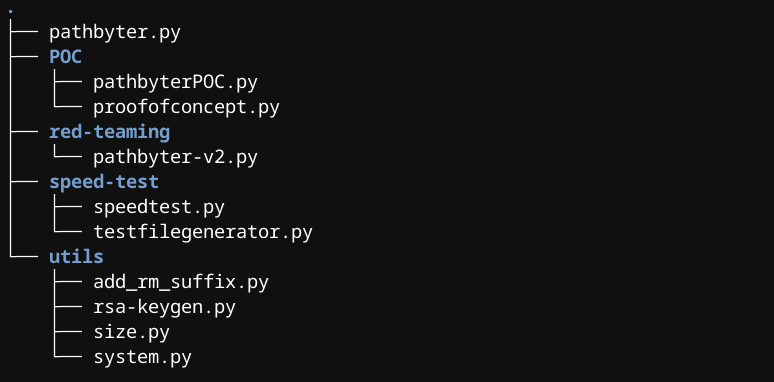
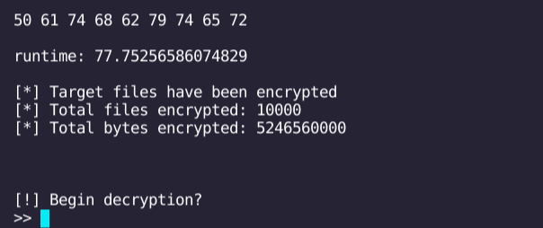

<p align="center">
<!-- Place this tag where you want the button to render. -->
<a class="github-button" href="https://github.com/0x00wolf/PATHBYTER-Hybrid-Encryption-Ransomware-with-Multiprocessing-in-Python" data-icon="octicon-star" aria-label="Star 0x00wolf/PATHBYTER-Hybrid-Encryption-Ransomware-with-Multiprocessing-in-Python on GitHub">Like this project? Give it a star! Click here</a>

# Pathbyter: Hybrid Encryption Ransomware with Multiprocessing in Python
***
Pathbyter is a lightning-fast and fully functioning proof-of-concept ransomware that emulates the tactics employed by malware like Lockbit, Conti, REvil, WannaCy, Lockbit, and Ryuk. Based on speed tests which you can learn about below, Pathbyter is siginificantly faster than ransomware deployed by threat actors in the wild. This project is an exploration of the more advanced programmatic features employed in the development of modern ransomware. Included in this repository are a number of iterations of Pathbyter, including a 100% safe to execute proof-of-concept version that can walk curious programmers through the process of an attack without any risk of losing data.


## Table of Contents

1. [Why build Pathbyter?](#why-build-pathbyter)
2. [Disclaimer](#Disclaimer)
3. [Requirements](#Requirements)
4. [What's in this repository?](#whats-in-this-repository)
5. [Usage](#usage)
6. [How fast is Pathbyter?](#how-fast-is-pathbyter)
8. [How Pathbyter works:](#how-pathbyter-works)


***
## Why build Pathbyter?

I am a very curious person. While reading security research reports on different ransomware strains, I saw a pattern of programmatic features common among them that interested me. I researched Python ransomware projects on Github to see what solutions others had come up with to emulate those features. Almost every example I read encrypted files in an os.walk() loop and then displayed a ransom message asking for Bitcoin. Many lacked most if not all of the elements that I was really curious about. I had some ideas as to how I would go about implementing those features. Mix in some time and creative problem solving and we arrive at Pathbyter.


***
## Disclaimer

Pathbyter is intended for educational purposes or for approved red team exercises only. The author does not take any responsibility for the misuse of this software, nor does he approve of the redistribution of this software for anything other than legitimate educational and/or professional reasons. **Do not use Pathbyter on a box you have not been given express permission to run it on.** There isn't a ransom message built into this project for a reason. 

<a class="github-button" href="https://github.com/0x00wolf/PATHBYTER-Hybrid-Encryption-Ransomware-with-Multiprocessing-in-Python" data-icon="octicon-star" aria-label="Star 0x00wolf/PATHBYTER-Hybrid-Encryption-Ransomware-with-Multiprocessing-in-Python on GitHub">Please do give this project a star if you like the code!</a>


***
## Requirements

Pathbyter uses one non-Standard Python Library module, pycryptodome, to gain access to the various cryptographic ciphers that it provides. 

To install pycryptodome use:

```pip install pycryptodome```

Check out the [readthedocs](https://pycryptodome.readthedocs.io/en/latest/).


***
## What's in this repository?



- **pathbyter.py**: is the clean code version of Pathbyter for individuals who are just interested in diving into the code.
  
- **private.pem**: is the associated RSA private key to the hardcoded RSA public key found in every version of Pathbyter in this repository.

- **pathbyter-POC Directory**
    - **pathbyter-POC.py**: This is the 100% safe to run proof-of-concept version of Pathbyter. This version of Pathbyter is specifically intended for students and programmers interested in learning about how modern ransomware functions on a programmatic level. Running this program will walk you through a ransomware attack without any risk of encrypting your data. To learn more about the proof-of-concept version, see the [Usage](#usage) section below. 
    - **proof-of-concept.py**: An additional 100 lines of code that adds supporting logic to pathbyer-POC.py.

- **red-teaming Directory**
    - **pathbyter-v2.py**: A streamlined version of Pathbyter with some minimal argv tooling.

- **speed-test Directory**
    - **speedtest.py**: This is the version of Pathbyter I used to run the speed tests.     
    - **testfilegenerator.py**: A simply Python script to create a series of files of a specified length.

- **utils Directory**
    - **rsa-keygen.py**: An RSA keypair generator.
    - **size.py**: A simple script I created to test the length of the RSA wrapped AES keys to append them to the end of encrypted files.
    - **system.py**: A standalone version of the System class that provides a lot of the functionality for Pathbyter. On instantiation, a System class object checks for an internet connection, fetchs a public ip if there is internet, and collects a sequence of useful information about the box it was created upon. It also has a built in path_crawl() method that can be used to fetch a list of files recursively from a selected parent directory or using os.path.expanduser('~') on Mac, Windows, or Linux.


***
## Usage:


***
## How fast is Pathbyter?

Pathbyter, as it says in the intro blurb, is wicked fast. To generate test data that would allow me to compare Pathbyter's encryption performance to 'real' ransomware in the wild, [I used research courtesy of Splunk.](https://www.splunk.com/en_us/blog/security/gone-in-52-seconds-and-42-minutes-a-comparative-analysis-of-ransomware-encryption-speed.html) 

**Splunk**:
>We tested every sample across all four host profiles, which amounted to 400 different ransomware runs (10 families x 10 samples per family x 4 profiles). In order to measure the encryption speed, we gathered 98,561 test files (pdf, doc, xls, etc.) from a public file corpus, totaling 53GB.

**The researchers at Splunk arrived at the following results:**


**Initial Testing**

I did most of the development for Pathbyter in VScode on my Pixelbook Go, so it was an easy choice for my first round of testing. Due to disk constraints I used a scaled down version of the splunk test:

I generated 10,000 files at 512 kb. The contents of each file was "Hello World!" repeated many times. 

I also streamlined Pathbyter's code (dropped internal function calls for the main attack loop), to try and improve optimization at runtime for a reduction in the cleanliness of the code. I used the variant of Pathbyter that appends keys to the file, and didn't bother changing the name of the encrypted files.

A note: It doesn't matter if the files that are being encrypted different of types if they are the same size. Splunk's researchers used a file corpus for their data, which is a collection of different text documents. File types are identified by the OS via the magic bytes at the start of the file. The filetype and the substance of its contents are irrelevant in regard to the time it takes to encrypt the file, only the size is important.

**The Outcome:**



**On its first run, Pathbyter encrypted 5gb / 10,000 Files in 77.75 seconds in a VScode terminal on my Chromebook.** To meaningfully contrast with Splunk's runtimes, we take Pathbyter's runtime of 77.75 and scale up by ten. So, we multiply 77.75 by 10 and divide by 60. We get 12.95, which is 12:57 seconds.

With a total runtime of 12:57, Pathbyter would have placed third in Splunk's testing, which is more than 3 times faster than the median encryption speed of the ransomware Splunk tested.


**Testing Round Two: The Full Monty**

This time I wrote a Python script that generated 100,000 garbage files, each 512kb, filled with a quote from the movie Hackers repeated many times. I used a desktop running Windows 10, with a Ryzen 5800x CPU, 32gb ddr5 3600mhz memory, and an NVME 4 ssd.


**Pathbyter's performance during the second round of testing:**

| Run | Elapsed Time  |
| --- | ------------  |
|  1  | input me      |
|  2  | input me      |
|  3  | input me      |
|  4  | input me      |
|  5  | input me      |
|  6  | input me      |
|  7  | input me      |
|  8  | input me      |
|  9  | input me      |
| 10  | input me      |

**Pathbyter's median encryption time:** 

**Conclusions:**

Encryption is a CPU heavy task. If you have one process encrypting all the files, it is obviously slower than spawning as many new processes are there are logical processors present, splitting the target files up equally between them, and having each process encrypt their share of the files asynchronously. Basically, with multiprocessing you can speed up encrypting files, even if the code is written in a scripted language like Python, and it can be by a significant multiplier. 

Because malware authors tend to favor low level languages that have a small footprint and are very portable (like C), I believe that the reason for the median speed from Splunk's tests highly contrasting the faster ransomware variants has to do with whether or not they are employing multiprocessing in their code. With Python, I noticed a 3-4 times increase in runtime when I switched to multiprocessing. The fastest variants in Splunks testing were on average 3-4 times faster than the median, with the exception of Lockbit, which is ridiculously fast. The speed increase is coincidentally pretty close. Python would be slower than a compiled language when it came to runtime, so this would explain why Pathbyter is significantly faster than the median, but slower than the fastest examples.


***
## How Pathbyter works:

**The ransomware attack:**

- At runtime Pathbyter generates an instance of the System class, checking for a public ip, and gathering information about the victim box. It then uses a System class method to generate a target id card, which includes a UUID as well as network, user and hardware information.
- Pathbyter generates a new AES 128-bit key and uses it to encrypt the id card with an AES CBC cipher.
- Using the attacker's hardcoded  RSA-4096 public key, Pathbyter encrypts the AES key.
- Then the encrypted id card, associated encrypted AES key and the key's initialization vector are written to a JSON database, 'donotdelete.json'.
- Next, a new session RSA keypair is generated.
- A note: A session keypair is generated at the start of each attack, so that the victim is able to share the encrypted session RSA private key with the attackers, and they can return the unencrypted private key, without compromising the confidentiality of the attacker's private key associated with the hardcoded public key used in every attack.
- The session RSA private key is immediately encrypted with a new AES key in memory and function scope, the new AES key is wrapped with the attacker's public key, and the necessary information is added to the JSON decryption stub.
- The session RSA public key is returned to the main program ready to encrypt.
- Pathbyter uses the System.path_crawl() method to generate a list of a target files.
- Pathbyter generates a multiprocessing Pool class instance, which takes one argument - the number of processors to generate new processes with.
- Pathbyter uses the Pool class' map method, which takes two arguments, a function and an iterable. The map method splits up the iterable equally among the processes in the pool, and then runs the function asynchronously on the different processes, each passing their set of variables one at a time to the function in a loop until all are finished.
- The attack function: opens the target file in read bytes mode, reads the file's bytes into a variable > generates a new AES-128 bit key > uses an AES CTR cipher to encrypt the file data > wraps the AES key with the session RSA public key > reopens the file in write bytes mode > writes the encrypted data and concatenates the wrapped AES key and nonce to the end of the file.
- After the encryption process is finished, Pathbyter appends '.crypt' to all of the filenames in the target files list.
- Finally Pathbyter will print out the encryption time instead of present a ransom note.

**Decryption:**

- The decryption process is completely unconcerned with speed. It uses a System.path_crawl() to collect all the files that end in .crypt and decrypts them one at a time. It slices the last 314 bytes off of each file when it opens them in read bytes mode to recover the encrypted AES key and nonce. It writes the unencrypted RSA public key out, which is kind of unthematic in that an attacker would do this remotely, but it was convenient to just have the private key sitting in the same folder.


  

Something I noted frequently in my research was that the various stages of the the cyberattacks in which ransomware get deployed seem to often be misattributed to the ransomware, rather than the hackers themselves. Ransomware does not phish or spear phish, gain access, elevate privileges, achieve persistence, and exfiltrate data before deploying the itself, those are threat actors. This project made me feel that ransomware itself is really a system's administration tool gone awry, and that the ransomware that encrypt slower still ultimately achieve the same effect if deployed, dare I say, intelligently (after hours, etc.).

Pathbyter only uses in-memory encryption. This means that decryption keys, the session RSA private key or any of the AES keys, are never written to disk before being encrypted. This is something malicious actors do to prevent the recovery of the keys by a skilled defender working on behalf of the ransomware victim. Deleted items may still be stored on the same sector of the disk if that portion of the harddrive hadn't been written oversince. To capture a key in-memory, a snapshot of the ram would need to have been taken at the moment of encryption. This method also further limits input and output operations that en-masse can bog down the processors and lengthen the overall runtime.

Appending the encrypted keys to the files means that you can significantly limit the number of read and write operations that the processes have to perform over a large number of files. You read the file into a variable in write bytes mode and then close it > generate a new AES-128 bit key > encrypts the variable with the new key and an AES CTR cipher > wraps the AES key with the session RSA public key > reopens the file in write bytes mode > write the encrypted data and the key. So for each file you only read and write to the disk once. Pathbyter uses the fastest AES cipher, CTR or Counter mode to encrypt files, but AES CBC to encrypt the RSA session private key (just to spice things up a bit).

